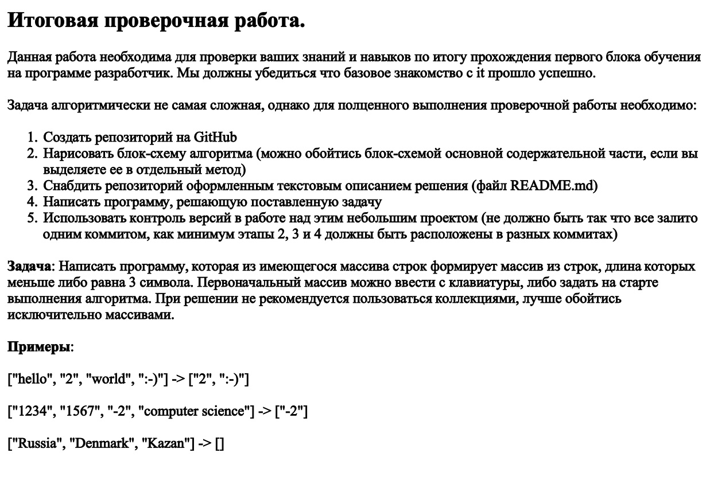

Создана папка для решения провнрочной работы

https://github.com/leksafox/FW_240123/tree/main/Final_Work

# **Задача:**

## *Написать программу, которая из имеющегося массива строк формирует массив из строк, длина которых менее либо равна 3. Первоначальный массив можно ввести с клавиатуры, либо задать на старте выполнения алгоритма. При решении не рекомендуется пользоваться коллекциями, лучше обойтись исключительно массивами.* ##

**БЛОК-СХЕМА** [.drawio](Final_Work/FinalWork.drawio.png)

